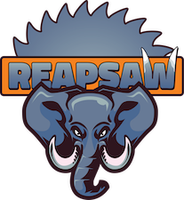
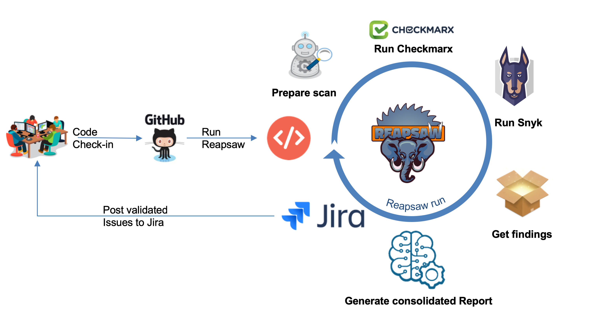

## Reapsaw


### Introduction

Dow Jones Reapsaw is our way to embed security testing within an SDLC lifecycle. This helps to ensure that security testing is consistent and effective.

Reapsaw is an orchestration platform for various security tools (static and run-time) which helps in identifying different types of security bugs during the process (open source vulnerabilities, static code security bugs,  insecure functions, secrets in code, authentication bypass etc.). 
It can be easily integrated into already-established process and tools in an organizations SDLC, bug trackers, source repositories and other testing tools. Being CI/CD friendly,once enabled within the CI pipeline, reapsaw will help in identifying very high fidelity and low false positive bugs into developers backlog. This will enable in quick feedback and provide developers friendly recommendations on fixes. 




Static application security testing (SAST) is a set of technologies designed to analyze application source code for coding and design conditions that are indicative of security vulnerabilities.

### Technologies
- Python 3.6
- Snyk 1.110.2
- Checkmarx v8.8.0
- ReportPortal 4.3.0
- Docker

### Documentation
- [Wiki](https://github.com/dowjones/reapsaw/wiki)

### Tests

- see also [CONTRIBUTING](https://github.com/dowjones/reapsaw/blob/master/CONTRIBUTING.md)

```
tox -e install
tox -e test
```